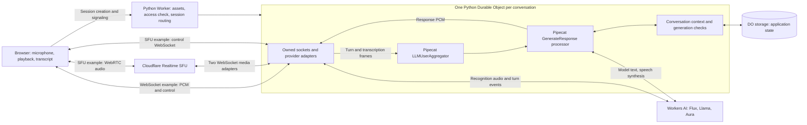

# Architecture review and proposed spike closeout

Reviewed 25 September 2026. Implementation commit: `bc38cea`.
Deployed version: `acc191fa-56ef-4fc7-a4fa-8545061a079d`.
**Decision status: proposed; final acceptance scope and next implementation work
have not yet been agreed with the user.** This review changes documentation and
organizes commits; it changes no deployed audio or interruption behavior.

## Verdict against the original question

**Works with restrictions.** Real Pipecat runs directly inside one Cloudflare
Python Durable Object per conversation. Its pipeline queues, external turn
handling, interruption cancellation, and context machinery are exercised.
There is no Python agent server, container, or Cloudflare Voice Agents package.

The feasibility question is answered. The original demo acceptance is not fully
closed: the delivered source lacks a current ten-minute acceptance run, structured
physical interruption measurements, and a completed speaker-feedback assessment.
The SFU example proves an additional live media path, but does not have feature
or validation parity with the WebSocket example.

## What actually runs

1. **The browser handles devices.** It captures audio, plays responses, shows
   transcripts, and can request interruption. The direct WebSocket player also
   sends chunk-completion receipts. SFU playback has no equivalent receipt.
2. **The Worker handles entry and routing.** It validates the demo access key,
   allocates a random conversation ID/capability, and routes to its DO. The key
   prevents unrestricted use of the publicly accessible model-backed demo.
3. **The DO owns the live conversation.** It holds control sockets, the Pipecat
   worker, provider resources, the selected audio transport, and cleanup tasks.
   This is a live, nonhibernating pipeline, not serialized Python execution.
4. **The actual application pipeline has two processors:**
   `LLMUserAggregator → GenerateResponse`. Flux recognition and turn events enter
   through callbacks. `GenerateResponse` awaits the model, optional fictional
   appointment lookup, and speech synthesis inside Pipecat's cancellable frame
   handler. This is real Pipecat with custom remote I/O, not the full upstream
   collection of provider and transport plugins.
5. **Storage holds application state only.** Messages, generation, transport,
   status, and the capability hash survive. Coroutines, socket connections,
   queued PCM, and playback positions do not. Reconnect builds a fresh pipeline;
   uninterrupted recovery is not claimed.

The key code is [entry.py](src/entry.py), [conversation.py](src/conversation.py),
[providers.py](src/providers.py), [app.js](public/app.js), and, for WebRTC,
[sfu_transport.py](src/sfu_transport.py) / [sfu-client.mjs](public/sfu-client.mjs).

## The Pipecat compatibility patch

The patch changes **six source files** in a checksum-verified subset of Pipecat
1.11.0. It defers optional native imports, makes startup import prewarming
optional, and supplies a source version without installed package metadata.
Pipecat's queueing, interruption, and turn algorithms remain upstream code.

There are 119 vendored Python modules (about 1.03 MB of source), because normal
installation pulls in unused native audio/model dependencies. That source size
is not runtime memory usage. Vendoring is acceptable for this experiment but is
maintenance debt for a supported service. A small upstream compatibility change
and a remote-only dependency option would be preferable to growing the fork.
See [the reviewable patch](pipecat-compat.patch),
[manifest](src/pipecat/VENDOR_MANIFEST.json), and [compatibility findings](COMPATIBILITY.md).

## Complexity: keep, simplify, or defer

| Area | Judgment | Recommendation |
| --- | --- | --- |
| One DO and one Pipecat pipeline per call | A good fit for session ownership | Keep. No separate orchestration service is needed. |
| Generation IDs, browser clear, bounded buffers | Required to reject stale audio and avoid unbounded queues | Keep; do not remove these to reduce line count. |
| Provider resource ownership and late-result cleanup | Required by async streaming and the Python/JavaScript boundary | Keep focused adapters; avoid adding a generic provider framework. |
| Sentence-level WebSocket receipts | A deliberate, conservative answer to the original history requirement | Keep. They represent browser scheduling completion, not proof the human heard speech. |
| New SFU publication and receiving peer for every response | Conservative stale-RTP isolation, but adds SDP/ICE setup and ownership work to every reply | Treat as an experimental tradeoff. Measure its cost before attempting a persistent-track design. Reusing a track without a proven flush boundary would weaken correctness. |
| Two WebSocket SFU adapters and PCM conversion | Required by the chosen Cloudflare adapter protocol | Keep within the SFU module. These are transport costs, not reasons to move Pipecat to another server. |
| Custom amplitude-based interruption plus provider turn detection | Two interruption sources with an unresolved speaker-echo problem | Measure echo cancellation and qualify interruption better in a focused follow-up. Do not merely keep adding thresholds. |
| Fictional tool dispatched by a keyword | Sufficient for the requested harmless example | Keep small. Generic model-selected tools are outside this spike. |
| Multiple long reports repeating the same status | Documentation overengineering that has already produced contradictions | Use this review as the current decision/evidence index, a short README for running, and detailed historical reports for research. |
| Durable cleanup services, multi-tenant auth, provider plugins, deployment automation | Product work beyond the original feasibility question | Defer until the runtime/voice acceptance and customer requirements justify them. |

## Concrete findings to resolve or explicitly accept

**SFU assistant memory is incomplete.** `ConversationSession` intentionally
does not put SFU replies into assistant history because submission is not proof
of playback. A follow-up such as “expand your second suggestion” therefore lacks
the prior assistant answer. This is a real functionality gap, not just a missing
test. A later design may keep generated/unconfirmed text separately from
played-confirmed history, but those semantics need agreement. Never promote
`playback_ready`, sent bytes, or a timer into a played receipt.

**SFU clear waits for remote cleanup.** `ConversationSession.invalidate()` sends
browser clear, then awaits `SfuTransport.clear()`, which performs sequential SFU
REST cleanup. This can delay Pipecat's next-turn processing even when local
playback has stopped. It also records `server_clear.dispatch_ms` after cleanup,
so that metric does not isolate dispatch time for SFU. The small proposed fix is
immediate invalidation/measurement plus one owned, bounded cleanup task—not a
new cleanup service. No fix has been applied during this review.

**SFU final cleanup is best effort.** Failed remote closes retain resource IDs
inside the transport, but the DO drops its session/transport references at End.
There is no durable retry owner. One bounded final retry and explicit diagnostic
reporting would fit the spike. The two-turn browser check did not export server
cleanup counters, so browser “Resources released” must not be treated as proof
that all remote SFU resources are gone.

**Speaker echo is an observed limitation.** The browser already requests echo
cancellation, noise suppression, and gain control. Its local detector can
interrupt after roughly 60 ms above its amplitude threshold; Flux can also
independently detect echoed speech. The actual cancellation effectiveness and
natural spoken interruption have not been measured. Headphones avoid this
acoustic feedback path; half-duplex listening would sacrifice spoken barge-in.
The prior explanation-only request remains respected: no echo behavior changed.

## Evidence for this revision

The current deployed source hashes match the delivered source and the earlier
two-example deployment `ae7676d0`. The later `acc191fa` deployment added SFU
secrets only. Older duration and cancellation results remain useful evidence,
but cover different source revisions.

| Criterion | Evidence | What remains |
| --- | --- | --- |
| Real Pipecat in a Python DO | Actual-DO probe and both deployed provider paths | Full upstream Pipecat compatibility is not claimed. |
| Current WebSocket voice round trip | [Recorded-speech smoke](evidence/websocket-two-examples-smoke.json), current source; zero owned-resource counters at End | Structured physical-device acceptance. |
| Current SFU/WebRTC round trip | [Activation](evidence/sfu-activation.json): two generated-speech inputs and nonzero decoded responses, generations 3 and 5 | Physical playback, barge-in, history parity, reconnect, and authenticated server cleanup counters. |
| Ten-minute duration, pause, repeated interrupts, concurrency, reconnect | [Historical two-call duration](evidence/real-provider-soak-summary.json), [recorded pause](evidence/real-provider-pause-1s.json), version `69b1b14d` | Repeat focused acceptance on the frozen final WebSocket source. Topic routing is not exhaustive semantic isolation. |
| Interrupt pending tool/model | Tool on `69b1b14d`; [model and recovery](evidence/real-provider-model-cancellation-capacity-fix.json) on `a0fddf09` | Same-revision focused rerun. Preserve earlier 429 failures as failures. |
| Controlled restart | [Actual local DO public-SDK restart](evidence/workerd-lifecycle-py314-sdk.json) and [capacity lifecycle](evidence/workerd-lifecycle-capacity-fix.json) | Current-source short local rerun; seamless restart was never required. |
| Abandon cleanup | [Historical idle test](evidence/real-provider-abandon.json); current WebSocket End counters | Same-revision idle rerun and SFU server cleanup observation. |
| Memory and timing | [Local heap sample](evidence/workerd-heap-py314-after-soak.json), historical server/browser scheduling metrics | Whole deployed isolate memory and acoustic interruption-to-silence remain unmeasured. |
| Regression tests | [Review checks](evidence/review-checks.json): 41 Python, 50 browser, 12 harness, ten SFU routing, seven lifecycle, 22 auth; core/provider guards pass | These are offline checks, not new physical or ten-minute results. |

## Proposed next steps: awaiting agreement

**Recommended scope:** close the original runtime spike using WebSockets as the
acceptance baseline; retain the requested SFU example as an explicitly limited
experiment. Use headphones for the final physical session and list speakerphone
barge-in as unresolved. This does not claim that both transports meet every
original behavior equally.

1. Freeze the reviewed implementation and record its deployment/version hashes.
2. Reuse the existing harnesses for a current-source ten-minute/two-session run,
   pending model/tool cancellation, one recorded internal pause, abandonment,
   and the short local controlled-restart check. No new test framework is needed.
3. Run one structured physical headphone session: a natural pause, three spoken
   interruptions with recovery, a remembered user fact and previous-answer
   follow-up, fictional availability, reconnect, and End. A second independent
   session should use a different harmless fact. State sample counts and record
   acoustic stop time only if actually measured; otherwise explicitly leave it
   unmeasured. The user needs to participate in this device check.
4. Attach the final evidence to the frozen source and close with a qualified
   verdict. Keep remaining product work separate.

If instead we want **SFU and speakerphone parity before calling the spike
complete**, that is a larger next phase: resolve SFU history semantics, separate
interruption from REST cleanup, verify final remote cleanup, fix/measure acoustic
echo handling, then run the same acceptance suite on both transports. Do not
start a persistent-track rewrite or production platform work ahead of those
decisions.

## Logical commits

The folder previously had no Git history. These commits were created now; they
are not backdated development history. The WebSocket baseline was recovered
from the saved pre-SFU archive, and its runtime/browser/config hashes were
checked against deployed version `34485c22`. Current files were preserved while
that baseline was staged, then the existing SFU changes were committed separately.

| Commit | Scope |
| --- | --- |
| `4cf951b` | Pinned dependencies, vendored Pipecat, six compatibility edits, guarded core check. |
| `c51f437` | Working WebSocket application, provider/lifecycle behavior, tests, historical evidence. |
| `bc38cea` | SFU codec/transport/client, two-example UI, tests, and activation evidence. |
| Review documentation commit | This review, concise run instructions, corrected current/historical claims, regression evidence. |

Commits are local. No remote repository or push was requested. Credentials,
recordings, caches, environments, and scratch work are excluded.
