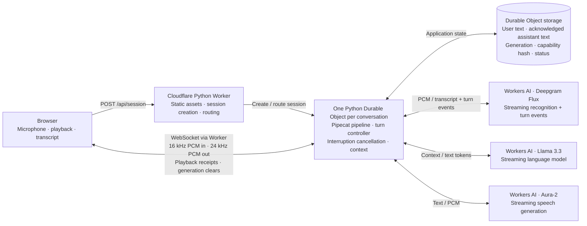

# pipecat-on-workers

Pipecat running inside a Cloudflare Python Durable Object.

**Two examples:** open `/websocket` for direct browser–DO audio or `/webrtc`
for browser WebRTC through Cloudflare Realtime SFU. The home page is a chooser.
Both share the same Pipecat conversation engine and Workers AI providers.
See [TWO-EXAMPLES.md](TWO-EXAMPLES.md) for architecture, code locations, SFU
credentials, testing, and the difference in playback/history guarantees.
The SFU app is configured with encrypted Worker secrets. Two generated-speech
turns passed through real browser WebRTC, the SFU, Pipecat, and Workers AI, with
nonzero decoded response audio. See [SFU activation evidence](evidence/sfu-activation.json).
This does not establish physical speaker echo cancellation or audible interruption.

**Project rename:** the project and Worker are now named **pipecat-on-workers**.
The live demo URL is [pipecat-on-workers.korinne.workers.dev](https://pipecat-on-workers.korinne.workers.dev).
See [rename evidence](evidence/project-rename.json). Historical evidence retains
its original deployment URLs and version IDs.

**Access-key update:** the application verifies access before opening the
microphone and supports loading the supplied key text file directly. Missing,
incorrect, and unconfigured keys now produce distinct messages. The delivered
key and the browser file-loading flow were both verified successfully. See
[evidence/access-key-fix.json](evidence/access-key-fix.json). The key stays in
memory and is sent only in authentication headers; it is not saved in browser
storage or included in the source archive.

**Capacity update:** the application includes bounded startup retries, clear
provider-capacity errors, and immediate startup cancellation. See
[CAPACITY-FIX.md](CAPACITY-FIX.md) for its tested version and checks. Earlier
long-duration results below remain tied to their recorded deployment.

**Microphone troubleshooting update:** a user reported speaking while the demo
showed Listening but received no transcript. After the microphone update, the
user confirmed “okay this is working!”—a user-reported basic live success.
The updated source requests audio-engine resume directly in the Start handler,
before the authentication wait, and adds a live sound meter, **Resume audio**,
and separate capture, upload, server-receipt, and provider-forwarding counters.
The confirmation does not establish the earlier failure's cause or a measured
duration/acoustic acceptance pass.

A small voice-agent spike with one Python Durable Object and one actual Pipecat
pipeline per conversation. There is no agent server, container, Cloudflare Voice
Agents package, or browser turn-completion model. Only the WebRTC example uses
an SFU, as a media transport.

**Runtime verdict: works with restrictions in deployed Python Durable Objects.**
The [protected demo](https://pipecat-on-workers.korinne.workers.dev) runs real
Pipecat inside Python 3.14.2 / Pyodide 314.0.6. Deployment
`69b1b14d-e27b-4ebc-8623-33dc94d5c186` passed
**600.011 seconds with two simultaneous actual-provider calls**, 20 recorded
inputs, ten interruptions and ten subsequent successful responses, one reconnect
with restored history, no reported errors, and zero retained live resources.
See [the measured duration result](evidence/real-provider-soak-summary.json).
A strict one-second recorded-pause check and 30-second idle cleanup also passed.
The [normal tool smoke](evidence/real-provider-tool.json) returned the fixed
fictional availability: Tuesday at 10 AM and Thursday at 2 PM.
Pending-tool cancellation passed on that earlier deployment. On capacity-fix
version `a0fddf09-a341-4b07-bd50-84adcc2ffed1`, [pending-model cancellation and a following spoken
response passed](evidence/real-provider-model-cancellation-capacity-fix.json),
with no canceled audio after clear and zero owned resources after End.
Earlier failed startup attempts remain preserved as historical evidence.

**Physical microphone/speaker acceptance remains incomplete.** These checks use
prerecorded input and elapsed playback receipts; they do not measure acoustic
delivery or audible interruption. `/api/health` intentionally retains
`voice_validated: false` for this outstanding physical acceptance, despite the
recorded-provider passes. Two earlier local four-DO fixture runs also passed;
the older Python 3.13 configuration reproducibly crashed. The delivered code uses
the public SDK without a private restart workaround. See [REPORT.md](REPORT.md)
for pending-work/tool results and remaining limits, and
[COMPATIBILITY.md](COMPATIBILITY.md) for the implementation findings.

## What runs where (WebSocket example)



The browser resamples microphone input to 16 kHz mono PCM16. Flux supplies turn
start/end events; the application's configured turn-end grace can join resumed
speech fragments before finalizing the user turn. Pipecat's external-turn
strategies and user aggregator update context; a frame processor awaits model and speech streams so Pipecat can
cancel its current work on interruption. Independent generation IDs prevent old
provider results or queued browser audio from entering the next turn.

## Run locally

Tested tooling: **Node.js 22**, **uv 0.12.18**, and **Python 3.14.7** for the local
Python environment. Wrangler and Python dependencies are pinned in the lockfiles;
the Workers runtime supplies its own Python interpreter. Pipecat **1.11.0** is
vendored as a narrowly patched source subset; do not install the full
`pipecat-ai` distribution over it.

From this directory:

```sh
npm ci
uv sync --python 3.14.7
uv run pywrangler sync
uv run pywrangler dev --local --var ENABLE_TEST_ROUTES:true --var ALLOW_UNAUTHENTICATED_LOCAL:true
```

Open the local URL printed by Wrangler, normally
[http://localhost:8787](http://localhost:8787). This starts the real Worker and
Durable Object runtime. The browser always selects real providers; the command
above enables separate automated fixture tests, not a simulated browser call.
Without authenticated remote Workers AI access, pressing Start cannot produce
a real conversation.

Run checks from another terminal while that development server is running:

```sh
node --test public/*.test.mjs
node --test scripts/*.test.mjs
uv run pytest -q tests
uv run python scripts/check_pipecat_core.py
uv run python scripts/check_providers.py
uv run python scripts/check_entry_lifecycle.py
uv run python scripts/check_access_auth.py
node scripts/check_worker.mjs
```

These cover browser/harness logic, conversation behavior, the patched core,
and provider adapter behavior. `check_worker.mjs` uses actual network WebSockets and local Python Durable
Objects to exercise isolation, reconnect, controlled restart, End, and abandoned
connection cleanup, with explicitly synthetic providers and silent PCM. It
writes `evidence/workerd-lifecycle.json`. It accepts a different development URL
as its first argument.

The updated application passed **41 Python tests with ten additional subtests**,
**50 browser tests**, **12 harness tests**, **seven entry-lifecycle cases**, and
**22 access-authentication cases**, and **ten SFU entry cases**. These offline checks do not replace
real-provider or physical-device acceptance on the latest deployed version.

To reproduce the ten-scenario in-DO probe and save its runtime report, use the
same fixture-enabled server (change the URL if needed):

```sh
node scripts/probe_worker.mjs http://127.0.0.1:8787
```

This writes `evidence/workerd-probe.json` and prints a summary without exposing
the session capability. If the server requires a demo access key, set the
`DEMO_ACCESS_KEY` environment variable for the check scripts.

Fixture WebSockets require both `ENABLE_TEST_ROUTES=true` and `?fixture=1` in
addition to the session token. Only these sockets accept `fixture_event`.
The probe and controlled-restart routes are also gated by that flag. The browser
does not request fixtures, and `wrangler.jsonc` defaults the flag to `false`.

## Use real speech and language models

Cloudflare authentication was renewed for this deployment. To authenticate a
new environment to an account with Workers AI access:

```sh
npx wrangler login
```

For local development with remote model execution, change the `ai` entry in
`wrangler.jsonc` to:

```json
"ai": { "binding": "AI", "remote": true }
```

Then start the local application without fixture routes:

```sh
uv run pywrangler dev --var ALLOW_UNAUTHENTICATED_LOCAL:true
```

The selected models are `@cf/deepgram/flux`,
`@cf/meta/llama-3.3-70b-instruct-fp8-fast`, and `@cf/deepgram/aura-2-en`.
Provider calls use the Workers AI binding, not separate Deepgram or OpenAI keys.
The deployed recorded-input smoke test has exercised the full Flux/Llama/Aura
response path. Its evidence is in [the provider smoke result](evidence/real-provider-smoke.json).
Microphone, playback-device, and natural-conversation checks remain in
[VALIDATION.md](VALIDATION.md); a generic smoke pass does not establish pause handling.

Press **Start conversation**, allow microphone access, and speak. Use headphones
when testing interruption. Try “What appointments are available?” to exercise
the fictional, read-only availability tool. **Mute** sends silence so turn
detection can finish; **End** closes media and pipeline resources. The Session
details panel exports browser measurements without transcript, audio, or secrets.

If speaking produces no transcript, watch the sound meter and open **Session
details**. **Captured audio** shows microphone frames arriving in the browser;
**Audio sent**, **Server received**, and **Speech service sent** show successive
delivery stages. Byte counters can advance for silence and do not prove speech
recognition. If audio is paused, press **Resume audio**; if no samples or sound
arrive, check the selected input device and browser microphone permission.
The connection message now says “Connected. Say hello to start.” or, when stored
history exists, “Reconnected. Your conversation history is restored.” See
[the troubleshooting procedure](VALIDATION.md#microphone-troubleshooting) for
what to record without capturing audio or transcripts.

## Recorded-input provider checks

Run these commands from this directory with Node.js 22. They use actual providers
and never request fixture routes. Inputs must be **headerless PCM16, little-endian,
mono, 16,000 Hz**, between 0.2 and 15 seconds each; renaming a WAV file is not a
conversion. Prepare `normal.pcm` and `second.pcm` with different short neutral
questions, `tool.pcm` asking about appointment availability, and `pause-1s.pcm`
containing one utterance with a one-second internal pause. Set `VOICE_PCM_DIR`
to their directory below. Use an accurate `--speech-source` label: the examples
assume synthesized prerecorded speech; `prerecorded-human` is also available.

Enter the demo key privately at the `read` prompt. The scripts accept it only
through `DEMO_ACCESS_KEY`, never as a command argument. Keep credentials and raw
captures outside the source archive. `--capture-root` must be outside `outputs/`;
its private run directories contain transcripts, provider error details, and audio.
The separate evidence JSON contains allowlisted counts and timing metadata.

```sh
printf 'Demo access key: '
read -r -s DEMO_ACCESS_KEY
printf '\n'
export DEMO_ACCESS_KEY
export VOICE_BASE="https://pipecat-on-workers.korinne.workers.dev"
export VOICE_CHECK_WORK="$(mktemp -d "${TMPDIR:-/tmp}/pipecat-voice-check.XXXXXX")"
export VOICE_PCM_DIR="/absolute/path/to/your/recordings"

node scripts/smoke_real_voice.mjs --pcm "$VOICE_PCM_DIR/normal.pcm" --validate-input

node scripts/smoke_real_voice.mjs --base "$VOICE_BASE" --pcm "$VOICE_PCM_DIR/normal.pcm" --speech-source prerecorded-tts --capture-root "$VOICE_CHECK_WORK" --evidence "$VOICE_CHECK_WORK/smoke.json"

node scripts/smoke_real_voice.mjs --base "$VOICE_BASE" --pcm "$VOICE_PCM_DIR/pause-1s.pcm" --speech-source prerecorded-tts --expect-single-user-turn --capture-root "$VOICE_CHECK_WORK" --evidence "$VOICE_CHECK_WORK/pause-1s.json"

node scripts/smoke_real_voice.mjs --base "$VOICE_BASE" --pcm "$VOICE_PCM_DIR/tool.pcm" --speech-source prerecorded-tts --capture-root "$VOICE_CHECK_WORK" --evidence "$VOICE_CHECK_WORK/tool.json"

node scripts/check_real_pending.mjs --base "$VOICE_BASE" --pcm "$VOICE_PCM_DIR/normal.pcm" --tool-pcm "$VOICE_PCM_DIR/tool.pcm" --case all --capture-root "$VOICE_CHECK_WORK" --evidence "$VOICE_CHECK_WORK/pending.json"

node scripts/check_real_voice.mjs --base "$VOICE_BASE" --pcm "$VOICE_PCM_DIR/normal.pcm" --pcm-second "$VOICE_PCM_DIR/second.pcm" --duration-ms 600000 --sessions 2 --capture-root "$VOICE_CHECK_WORK" --evidence "$VOICE_CHECK_WORK/duration.json"

node scripts/check_real_idle.mjs "$VOICE_BASE" "$VOICE_CHECK_WORK/idle.json" "$VOICE_CHECK_WORK/idle-errors.private.json"
unset DEMO_ACCESS_KEY
```

The pause flag requires exactly one final user transcript and rejects any
assistant transcript or audio before the paced input ends. Without that flag,
the smoke script checks provider integration only. Pending-work checks use four
recordings across two fresh sessions, interrupt on `tool`/`thinking` before audio,
reject canceled-generation audio after clear, and require a completed recovery
sentence. The default duration check sends 20 recordings across two sessions,
performs ten explicit interruptions, and checks subsequent responses plus one
reconnect with acknowledged history. Distinct inputs do not by themselves prove
semantic isolation. The idle check sends no client audio or heartbeat and expects
the 30-second abandonment cleanup; its arguments are positional.

The pending script defaults to `--case all`. Use `--case tool` or
`--case thinking` to retry just that case in one fresh session with two inputs,
and choose a new evidence filename to retain the earlier result. The earlier
combined run passed tool cancellation, then the thinking session failed Flux
startup with HTTP 429 before receiving input; its cleanup reached zero. This is
a failed combined run and a provider-capacity failure, not a demonstrated failure
of model cancellation. The [isolated thinking retry](evidence/real-provider-model-cancellation.json)
also stopped at STT startup HTTP 429 with zero input and zero retained resources.
The later [capacity-fix run passed model cancellation and spoken recovery](evidence/real-provider-model-cancellation-capacity-fix.json).
The [combined capacity failure](evidence/real-provider-pending-capacity-429.json)
remains a separate failed result. Earlier tool-cancellation and ten-minute
observations remain tied to the duration-tested deployment.

Playback acknowledgments wait for each PCM chunk's elapsed duration; no speaker
or microphone is opened. These are actual-provider integration checks using
recorded input, not physical voice acceptance. End/idle cleanup must report zero
pipeline/provider tasks, sockets, readers, requests, queued/unacknowledged audio,
playback receipts, pending turn tasks, user fragments, and retained fragment text.
No test establishes cancellation of remote compute or billing. See
[VALIDATION.md](VALIDATION.md) for interpretation and the physical-device procedure.

Production connections wait **1,200 ms after the latest provider EndOfTurn**
before committing the final user transcript. A resumed StartOfTurn cancels that
wait and joins bounded fragments into the same request. This deliberately adds
1.2 seconds before generation after an uninterrupted provider end event. Fixture
connections use **zero grace**, so their timings cannot predict production
response latency. Final-transcript-to-first-audio measurements start after this
grace and exclude it; input-end-to-first-audio measurements include it along with
recognition and generation time.

## Deploy

Keep `ENABLE_TEST_ROUTES` set to `false`, and do not set
`ALLOW_UNAUTHENTICATED_LOCAL` in the deployed environment. Deploy, then configure a demo access key with Wrangler's interactive secret
prompt. Until the key is configured, public session creation is disabled:

```sh
uv run pywrangler deploy
npx wrangler secret put DEMO_ACCESS_KEY
```

Use the published HTTPS URL. Choose **Load key file** to load a text file
containing the key, or paste it into **Demo access key**. Loading the file checks
the key immediately; Start also verifies it before requesting microphone access. Session creation sends it in `X-Demo-Key`; the returned per-session
capability stays in browser memory. The SQLite Durable Object migration in
`wrangler.jsonc` is applied by deployment automatically.

The current deployment is [pipecat-on-workers.korinne.workers.dev](https://pipecat-on-workers.korinne.workers.dev).
The access-key flow was verified on version `33a5c3ed-17ba-47a7-9c77-db90cfbf3114`.
The demo key is configured,
unauthorized session creation returns HTTP 401, and fixture routes are off.
Production health reports Python 3.14.2 / Pyodide 314.0.6. Deployment and access
checks and the latest deployed version are recorded in [deployment evidence](evidence/deployment.json).

## Recovery, context, and limits

- **Persisted:** bounded conversation text, generation, capability hash, and
  session status. **Live only:** Pipecat tasks, provider sockets, PCM queues, and
  playback receipt bookkeeping. Reconnect creates a new live pipeline and
  restores stored text; it stops old audio. The controlled DO restart check
  exercises the same reconstruction path, not seamless call continuity. Its
  test route uses the public SDK `ctx.abort()` on the validated Python 3.14
  runtime. Earlier Python 3.13 failures and a rejected private workaround are
  retained in [the reproducer](repro/runtime-abort/README.md).
- Assistant history includes a sentence-sized segment only when every audio
  chunk belonging to it has a browser playback receipt. A partly heard segment
  is omitted conservatively. Web Audio completion is not proof of acoustic
  delivery, and the visible transcript can contain interrupted words.
- The example tool uses deterministic keyword dispatch and returns fixed
  fictional availability after a cancellable delay. It demonstrates tool
  integration and pending-tool interruption, not generic model-selected function
  calling or appointment booking.
- Context retains the system instruction and at most 80 recent messages.
  Server unacknowledged PCM is limited to eight seconds; browser buffering is
  capped at 12 seconds with a short scheduling horizon. Retained receipt metadata
  is capped at 256 chunks; oversized speech segments fail explicitly. These are queue bounds,
  not whole-runtime memory measurements.
- Pending user text is limited to 16 fragments and 8,192 characters. End and
  provider recovery cancel the pending finalization task and discard uncommitted
  text. Recovery closes the interrupted turn without replaying previous history
  as a new request; the user may need to repeat the lost utterance.
- End and disconnect close live resources. A connection sending no messages
  times out after 30 seconds. A storage alarm removes inactive application state
  on its next daily check; this is not immediate conversation deletion.
- The provider adapter checks once per second for missing input and sends silent
  PCM to keep Flux alive. This provider traffic does not extend the client's
  30-second abandonment timeout.
- This is an unsupported compatibility spike. Native VAD, existing Smart Turn
  analyzers, arbitrary Pipecat providers/transports, RTVI, video, hibernating
  pipelines, production access control, and fleet operations are outside its
  exercised configuration. See [COMPATIBILITY.md](COMPATIBILITY.md) for the exact
  changes and [REPORT.md](REPORT.md) for evidence and remaining work.

Browser scheduling metrics cannot establish interruption-to-audible-silence
latency. Natural speech, physical mid-utterance pauses, acoustic interruption
timing, and a ten-minute microphone/speaker session remain outstanding; the
report distinguishes them from recorded-input provider and synthetic checks.

## Source map

| File | Purpose |
| --- | --- |
| `src/entry.py` | Worker routing, DO lifetime, persistence, WebSocket ownership |
| `src/conversation.py` | Actual Pipecat pipeline, turn adaptation, tool, played-text context |
| `src/providers.py` | Async Workers AI streaming and cancellation adapters |
| `src/pipecat/` | Pinned, patched upstream source and provenance manifest |
| `public/` | Browser client, audio worklet, playback queue, client tests |
| `scripts/`, `tests/`, `evidence/` | Reproduction tools, checks, and measured results |

The [Cloudflare AI-audio example](https://developers.cloudflare.com/realtime/sfu/examples/ai-audio/)
informed the transport investigation. Direct browser WebSockets keep this spike
focused on whether the conversation runtime can execute inside the Python DO;
no SFU integration is claimed.

## Ten-minute runtime soak

With the local fixture-enabled server running and source edits stopped:

```sh
node scripts/soak_worker.mjs http://127.0.0.1:8787 600
uv run python scripts/soak.py --seconds 600
```

The first runs four actual Python DOs over WebSockets; the second runs four
CPython pipelines. Both use silent synthetic providers. Neither is a voice test.
Do not edit files or rebuild the development server while a soak runs: hot
reload terminates live calls. Evidence records elapsed wall time and cleanup.
The retained evidence distinguishes three failed Python 3.13 runs, the initial
short Python 3.14 experiment, and two passing ten-minute Python 3.14 runs. See REPORT.md
for the outcome; do not infer real-voice acceptance from any fixture result.


`/api/health` reports the actual Worker Python and Pyodide versions. With the
pinned Wrangler/workerd build and compatibility date 2026-09-24, it reports
Python 3.14.2 and Pyodide 314.0.6. Build tools/wheel URLs referencing 314.0.7 do not
mean that version runs inside the Worker. Keep the included lockfiles and date
when reproducing these results; changing either requires renewed validation.
The soak script accepts an optional fourth command-line argument naming an output
JSON file, allowing comparison runs without overwriting prior evidence.
