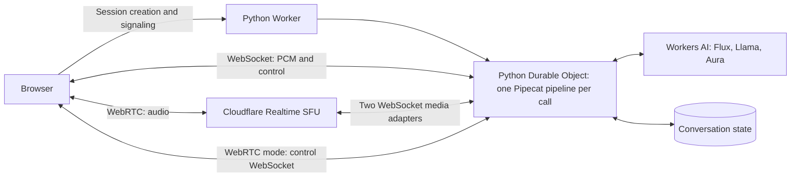

# Pipecat on Cloudflare Workers

A voice-agent experiment running Pipecat inside a Cloudflare Python Durable
Object. Each conversation owns one Pipecat pipeline, with Workers AI providing
Deepgram Flux speech recognition, Llama responses, and Aura speech synthesis.

The browser can use direct WebSocket audio or WebRTC through Cloudflare Realtime
SFU. Both paths have recorded live-provider round trips. The SFU path still needs
work on assistant history, interruption latency, cleanup, and media recovery.
See [SFU status and remaining work](docs/SFU-STATUS.md) for the implementation
checklist and the limits of the existing evidence.

## Try the demo

| Example | Audio path | Status |
| --- | --- | --- |
| [WebSocket](https://pipecat-on-workers.korinne.workers.dev/websocket) | Browser ↔ Python Durable Object | Baseline; completed playback sentences enter history. |
| [WebRTC / SFU](https://pipecat-on-workers.korinne.workers.dev/webrtc) | Browser ↔ SFU ↔ Python Durable Object | Experimental; assistant replies are currently omitted from history. |

The hosted demo requires an access key supplied by its owner. Load the key file
or paste the key, select **Start conversation**, allow microphone access, and
speak. Use headphones while speaker echo and spoken interruption are being
validated. **Mute**, **End**, and **Resume audio** are available during a call.

Try “What appointments are available?” for a fictional, read-only tool response.
Calls have a 15-minute limit. Physical microphone/speaker acceptance remains
incomplete, so `/api/health` reports `voice_validated: false`.

## How it works



The pipeline is `LLMUserAggregator → GenerateResponse`. Flux supplies turn
events; the response processor awaits model, tool, and speech work inside
Pipecat's cancellable frame handler. Generation checks reject stale output.
Storage keeps application state; reconnect creates a fresh live pipeline.

Pipecat 1.11.0 is a checksum-verified vendored subset with six compatibility edits.
It runs without a separate agent server or container. This experiment does not
support the full upstream set of native transports and audio plugins; see
[compatibility](COMPATIBILITY.md) and [the patch](pipecat-compat.patch).

## Set up your own deployment

You need Node.js 22 or later, [uv](https://docs.astral.sh/uv/getting-started/installation/),
Python 3.14, and a Cloudflare account with Workers AI and Durable Objects access.
Lockfiles pin the project dependencies, including Wrangler and the Python
Workers tooling.

```sh
git clone https://github.com/korinne/pipecat-on-workers.git
cd pipecat-on-workers
npm ci
uv sync --locked --python 3.14
uv run pywrangler sync
npx wrangler login
```

Choose your Worker name in `wrangler.jsonc`, then deploy and set the demo access
key at the private prompt. Session creation is disabled until a key is set.

```sh
uv run pywrangler deploy
npx wrangler secret put DEMO_ACCESS_KEY
```

For WebRTC, create a **Realtime → Serverless SFU** app in the Cloudflare dashboard
and configure its credentials on the same Worker:

```sh
npx wrangler secret put REALTIME_SFU_APP_ID
npx wrangler secret put REALTIME_SFU_APP_SECRET
```

The SFU app secret and demo access key serve different purposes. The `AI` binding
supplies model access without separate provider keys. Keep `ENABLE_TEST_ROUTES`
disabled on public deployments. Do not install the full `pipecat-ai` package over
the vendored source subset.

The SFU must reach the Worker's media callbacks over public WSS. A deployed
Worker supports the full path; plain localhost does not. Missing SFU credentials
produce `sfu_not_configured` when creating a WebRTC session.

## Develop and test

After installing dependencies, run the offline checks:

```sh
node --test public/*.test.mjs scripts/*.test.mjs
uv run python -m unittest discover -s tests -v
uv run python scripts/check_pipecat_core.py
uv run python scripts/check_providers.py
uv run python scripts/check_entry_lifecycle.py
uv run python scripts/check_access_auth.py
uv run python scripts/check_sfu_entry.py
```

To exercise synthetic providers inside a local Worker/DO:

```sh
uv run pywrangler dev --local --var ENABLE_TEST_ROUTES:true --var ALLOW_UNAUTHENTICATED_LOCAL:true
# In another terminal, using the port printed by Wrangler:
node scripts/check_worker.mjs http://127.0.0.1:8787
node scripts/probe_worker.mjs http://127.0.0.1:8787
```

These harnesses select fixture routes; browser **Start** still uses real
providers. For local real-model work, authenticate to Cloudflare and set
`"remote": true` on the `ai` binding. Store local secrets in an ignored
`.dev.vars` file. The local harnesses overwrite their named files in `evidence/`;
use a separate checkout when preserving recorded results.

## Code and documentation

| Entry point | Purpose |
| --- | --- |
| [src/entry.py](src/entry.py) | Authentication, routing, DO lifetime, SFU callback capabilities. |
| [src/conversation.py](src/conversation.py) | Pipecat pipeline, turns, cancellation, tools, and context. |
| [src/providers.py](src/providers.py) | Workers AI streaming and resource ownership. |
| [src/sfu_transport.py](src/sfu_transport.py), [src/sfu_codec.py](src/sfu_codec.py) | SFU signaling, adapters, PCM conversion, and cleanup. |
| [public/app.js](public/app.js), [public/sfu-client.mjs](public/sfu-client.mjs) | Browser controls and WebRTC peers. |
| [SFU status](docs/SFU-STATUS.md) | Prioritized gaps, code references, and acceptance checks. |
| [Transport protocol](TWO-EXAMPLES.md) | Signaling sequence and audio contracts. |
| [Validation](VALIDATION.md) | Recorded-input commands and physical-device procedure. |
| [Architecture review](ARCHITECTURE-REVIEW.md) | Architecture and evidence recorded on September 25. |
| [Compatibility](COMPATIBILITY.md), [runtime research](RUNTIME-RESEARCH.md), [report](REPORT.md) | Vendoring rationale and historical investigation. |

Live SFU evidence covers two recorded-speech turns with decoded response audio.
The longer WebSocket runs cover their recorded revisions and do not establish
SFU acceptance. See [the SFU evidence](evidence/sfu-activation.json) and
[the source-hash record](evidence/review-checks.json).
