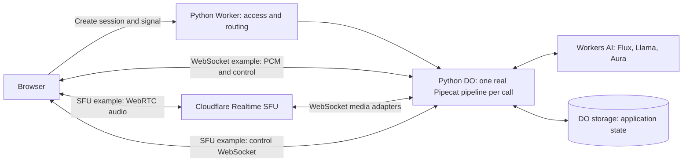

# pipecat-on-workers

A voice-agent spike running **real Pipecat directly inside a Cloudflare Python
Durable Object**, with two browser audio examples. No agent server, container,
or Cloudflare Voice Agents package is used.

**Verdict: works with restrictions.** The runtime feasibility question is answered.
Final acceptance on the delivered revision is still open; see the
[architecture review and proposed next steps](ARCHITECTURE-REVIEW.md).

## Try it

- [WebSocket example](https://pipecat-on-workers.korinne.workers.dev/websocket):
  direct PCM audio, sentence-level browser playback receipts, restored history.
- [WebRTC + Cloudflare SFU example](https://pipecat-on-workers.korinne.workers.dev/webrtc):
  real SFU audio in both directions, sharing the same conversation engine.
  Experimental: assistant replies are omitted from remembered history because
  playback cannot be confirmed. SFU cleanup and interruption caveats are in the review.

Both use the existing demo access key. Load its text file or paste the key,
press **Start conversation**, allow microphone access, and speak. Try “What
appointments are available?” for a fictional, read-only tool response. Use
headphones: speaker playback can currently be mistaken for an interruption.
**Mute**, **End**, and **Resume audio** are available on the call page.

The app requests browser echo cancellation; its effectiveness on speakers is
unverified. The recent architecture review did not alter audio behavior.

## Architecture



The actual Pipecat pipeline is `LLMUserAggregator → GenerateResponse`.
Flux supplies transcript and turn events. The response processor awaits the
model, optional fictional tool, and speech generation inside Pipecat's
cancellable frame handler. Generation IDs and playback clearing reject stale
output. Storage persists conversation state, not live tasks or buffered audio;
reconnect creates a fresh pipeline.

| Code | Responsibility |
| --- | --- |
| [src/entry.py](src/entry.py) | Worker routing, authentication, DO lifetime, SFU callback capabilities. |
| [src/conversation.py](src/conversation.py) | Pipecat pipeline, turns, cancellation, response/tool flow, context. |
| [src/providers.py](src/providers.py) | Async Workers AI streaming adapters and resource ownership. |
| [public/app.js](public/app.js) | Shared browser controls, microphone, transcript, interruption. |
| [src/sfu_transport.py](src/sfu_transport.py), [src/sfu_codec.py](src/sfu_codec.py) | SFU signaling, adapters, PCM conversion, generation ownership. |
| [public/sfu-client.mjs](public/sfu-client.mjs) | Browser WebRTC peers and negotiation. |
| [pipecat-compat.patch](pipecat-compat.patch) | Six isolated compatibility edits to pinned Pipecat source. |

See [TWO-EXAMPLES.md](TWO-EXAMPLES.md) for the transport protocol and
[COMPATIBILITY.md](COMPATIBILITY.md) for the patch and unsupported features.

## Install and deploy

Tested local tools: Node.js 22, uv 0.12.18, Python 3.14.7. Lockfiles pin Wrangler
4.139.0, workers-py 1.17.4, and workers-runtime-sdk 1.9.0. The deployed runtime
supplies Python 3.14.2 / Pyodide 314.0.6. Pipecat 1.11.0 is vendored; do not
install the full `pipecat-ai` package over this source subset.

From this project directory:

```sh
npm ci
uv sync --locked --python 3.14.7
uv run pywrangler sync
npx wrangler login
uv run pywrangler deploy
```

For a new deployment, enter a demo key at Wrangler's private prompt. Session
creation stays disabled until this is configured:

```sh
npx wrangler secret put DEMO_ACCESS_KEY
```

For WebRTC, create an app in Cloudflare **Realtime → Serverless SFU**, then enter
its ID and generated app secret at these prompts:

```sh
npx wrangler secret put REALTIME_SFU_APP_ID
npx wrangler secret put REALTIME_SFU_APP_SECRET
```

The existing deployed Worker already has all three secrets. The SFU app secret
is different from the browser demo key. Never commit credentials or recordings.
The `AI` binding supplies Flux, Llama, and Aura access; separate provider keys
are not used. Leave production fixture routes disabled.

## Local development and checks

Run the actual local Worker/DO runtime with gated synthetic-provider test routes:

```sh
uv run pywrangler dev --local --var ENABLE_TEST_ROUTES:true --var ALLOW_UNAUTHENTICATED_LOCAL:true
```

From another terminal:

```sh
node scripts/check_worker.mjs http://127.0.0.1:8787
node scripts/probe_worker.mjs http://127.0.0.1:8787
```

Use the port printed by Wrangler if it differs. Fixture routes are selected by
these harnesses, never by the normal browser. Browser **Start** still uses real
providers. For local real-model development, authenticate to Cloudflare and set
`"remote": true` on the `ai` binding before running `uv run pywrangler dev`.
SFU callbacks need a public WSS address; use the deployed Worker for full WebRTC.
Local secrets may go in an ignored `.dev.vars` file.

The fixture commands write `evidence/workerd-lifecycle.json` and
`evidence/workerd-probe.json`. Run them in a separate checkout when preserving
the historical artifacts referenced by the report.

Offline checks:

```sh
node --test public/*.test.mjs scripts/*.test.mjs
uv run python -m unittest discover -s tests -v
uv run python scripts/check_pipecat_core.py
uv run python scripts/check_providers.py
uv run python scripts/check_entry_lifecycle.py
uv run python scripts/check_access_auth.py
uv run python scripts/check_sfu_entry.py
```

The review reran 41 Python tests, 50 browser tests, 12 harness tests, ten SFU
routing cases, seven entry-lifecycle cases, 22 access cases, and core/provider
guards. [Review evidence](evidence/review-checks.json) records the implementation
commit and matching deployed source hashes.

## Evidence and remaining work

- **Current source:** real recorded-speech WebSocket round trip with owned-resource
  cleanup; two SFU/WebRTC turns with nonzero decoded response audio.
- **Historical source:** a 600.011-second actual-provider run with two simultaneous
  calls, pause/reconnect checks, repeated explicit interruptions, and cleanup;
  a later pending-model cancellation pass. These are not a current-revision soak.
- **Still open:** final same-revision acceptance, natural spoken interruption,
  speaker echo handling, acoustic stop timing, and the SFU history/cleanup gaps.
  `/api/health` therefore retains `voice_validated: false`.

[ARCHITECTURE-REVIEW.md](ARCHITECTURE-REVIEW.md) is the current decision and evidence
index. [REPORT.md](REPORT.md) preserves detailed historical measurements and
failures. [VALIDATION.md](VALIDATION.md) contains the existing recorded-input
commands and broader device-test procedure; the smaller proposed closeout is in
the review. The unlinked `/transport-check` page accepts a key file and generated
speech WAV for browser WebRTC testing without a physical microphone.

The repository has separate local commits for the compatibility layer, the
verified WebSocket baseline, the SFU extension, and this review. The history was
organized from saved work, not backdated. No remote is configured or pushed.
