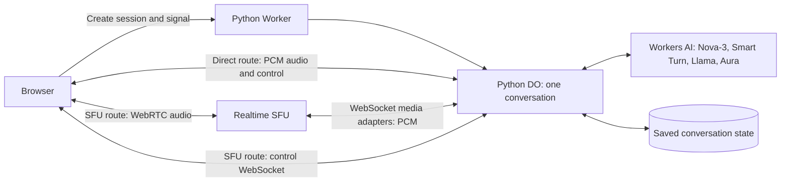

# Prototype baseline and current implementation

A person speaks into the browser. The application sends that audio to speech recognition, asks a language model for an answer, converts the answer to speech, and returns the audio to the browser. Pipecat coordinates the work inside a Python Durable Object (DO), which owns one call's live state.

The recorded baseline is application revision `6c17c0805f13f7609ba0a93ea8bf4c945797de18`. Task 2 changes recognition and turn completion in the current source, as described below. The baseline recordings and result files remain evidence of the original Flux configuration. [Goals](GOALS.md) describes the full intended configuration.

## Follow one conversation

The two routes carry the same user's conversation. An "SFU reply" means an assistant answer whose audio travels through the SFU. The SFU routes media; it does not generate the answer or decide conversation history.

| Component | Current responsibility |
| --- | --- |
| [Worker and DO entry](../src/entry.py) | Authenticate requests, create sessions, own call lifetime, and authorize SFU callbacks. |
| [Conversation](../src/conversation.py) | Run the adapted standard user aggregator and `GenerateResponse`, cancel responses, and save context. |
| [Turn adapter](../src/smart_turn.py) | Coordinate Nova onset, Smart Turn completion and final transcript readiness through Pipecat. |
| [Providers](../src/providers.py) | Stream Workers AI requests and own their tasks, readers, and sockets. |
| [Browser application](../public/app.js) | Capture the microphone, display transcripts, detect local speech onset, and control a call. |
| [SFU transport](../src/sfu_transport.py) and [audio conversion](../src/sfu_codec.py) | Negotiate media, convert PCM, and own tracks and adapters for each response. |
| [SFU browser client](../public/sfu-client.mjs) | Publish microphone audio and receive assistant audio over WebRTC. |

The Task 2 source selects Nova-3 (`@cf/deepgram/nova-3`) for recognition and hosted Smart Turn (`@cf/pipecat-ai/smart-turn-v2`) for semantic completion. It retains Llama (`@cf/meta/llama-3.3-70b-instruct-fp8-fast`) for text and Aura-2 (`@cf/deepgram/aura-2-en`) for speech. Calls use the Workers AI binding. The selected `@cf/openai/gpt-oss-120b` and standard assistant speech/output/context integration remain Task 3 work. The new turn connection passes controlled integration tests; it has no live Workers AI result yet.

In the historical baseline, Flux turn events fed Pipecat's external strategy and production waited an extra 1,200 ms after the latest end event; fixtures used zero grace. Those waits are removed from the Task 2 path. Nova speech onset now starts or resumes the Pipecat turn; its pause event requests Smart Turn analysis. The standard user aggregator receives text only after completion and final transcript coverage agree for the same current revision. The turn retains at most 16 final fragments, 8,192 characters and 8.2 seconds of PCM, with at most eight seconds per detector snapshot. [Coordination, timeout settings and timestamp limits](CONVERSATION.md#task-2-user-turn-coordination)

The response processor calls the model and speech service directly. A fictional appointment tool supplies fixed availability; it cannot book an appointment. Storage preserves conversation context, not running tasks or buffered audio. Reconnect creates a fresh pipeline.

## Current history and interruption behavior

The application has no assistant aggregator in its pipeline. It writes a completed assistant sentence into history after the direct WebSocket player reports completion of its audio chunks. The SFU route lacks matching sentence reports and bypasses that writer. Consequently, an SFU follow-up can lack the assistant answer it refers to.

Playback here means the browser player progressing through audio for its output device. It happens after generating and sending audio. A player callback is still not evidence that a person heard the sound. The [conversation plan](CONVERSATION.md) replaces the receipt-dependent history writer with the selected Pipecat speech/output and assistant-aggregator behavior.

On interruption, the application advances its response generation identifier and sends `clear`. The browser rejects older output. The SFU implementation then awaits cleanup of old media resources; slow cleanup can hold up the next model turn. A local test demonstrates that ordering, but does not measure when a speaker falls silent.

The prototype's `server_clear.dispatch_ms` metric includes subsequent cleanup work. Do not read it as the time needed only to send the browser clear event.

## Session and audio protocol

Requests use the same origin. Session creation requires `X-Demo-Key`. It returns a session ID and capability token; the browser keeps the capability in memory. SFU app credentials stay on the Worker.

| Endpoint or message | Meaning |
| --- | --- |
| `POST /api/session` with `{transport: "websocket"}` or `{transport: "webrtc"}` | Create a call and return its ID and capability. |
| `/api/session/{id}?token={token}` | Open the session WebSocket. On the direct route it carries audio and control; on the SFU route it carries control. |
| `POST /api/session/{id}/sfu` with `X-Session-Token` | Perform authorized SFU operations for that call. The server owns the SFU session IDs. |
| `ready`, `status`, `reset` | Report connection state, active generation, or restored history. |
| `transcript` | Report user or assistant text; interim updates are cumulative. |
| `clear.generation` | Set the minimum generation the browser may accept; discard lower generations. |
| `played` | Direct-route report that an entire scheduled chunk ended naturally. Canceled chunks are not acknowledged. |
| `playback_ready` | SFU receiver is connected and has a track. This is readiness, not completion of an answer. |
| `end` / `ended`, `ping` / `pong`, `error` | End the call, check liveness, or report a failure. |

Raw PCM represents sound as numerical samples. The direct route sends base64-encoded little-endian PCM16, mono, at 16 kHz into the Worker and returns mono PCM at 24 kHz. The browser resamples its capture rate into 20 ms input chunks. The current converter uses a basic fractional-window average; its speech quality still needs device testing.

The SFU adapter carries 48 kHz stereo PCM in protobuf messages. The Worker converts it to 16 kHz mono for recognition and converts 24 kHz mono synthesized speech back to 48 kHz stereo. Output is paced in 20 ms chunks. Browser-to-SFU WebRTC negotiation is a separate boundary from this raw-PCM adapter connection.

Direct-route output messages include a generation and chunk ID. The player schedules about 300 ms ahead, splits playback into stoppable slices no longer than 100 ms, and bounds total queued audio at 12 seconds. The server bounds unacknowledged audio at eight seconds and outstanding chunk receipts at 256. These are current implementation settings, not approved production targets.

## SFU setup and ownership

The browser publishes microphone audio using a send-only WebRTC connection. It waits for the connection before sending `input_ready`; the Worker then creates the input adapter. The UI waits for input readiness before saying Listening. The browser still uses local microphone processing for its meter and speech-onset interruption, but sends no microphone PCM over the control WebSocket. Muting disables the published track.

For each assistant response, the Worker creates a new ingest adapter and publication. It announces the track with its generation. The browser creates a fresh receiver and follows the SFU's offer/answer sequence. It does not pre-create an offer or transceiver before subscribing. Negotiation is serialized, and `playback_ready` waits for connection and track attachment. Waiting for an audio element's play promise at that point can deadlock startup.

When interrupted, the browser detaches and closes the old receiver, rejects old generations, and the Worker retires the old output. Separate receivers help isolate stale buffered speech, but require negotiation for every response. Reusing tracks is an optional optimization.

Media callback URLs are signed capabilities tied to the role, path, generation, and live connection. Late allocations and failed closes still need ownership until cleanup is resolved. A close request without confirmation is not evidence of zero remote resources. The baseline cannot promise durable reconciliation of every failed remote close after End.

## Browser lifecycle and current limits

The browser requests microphone access after accepting the demo key. Start creates and resumes its audio engine during the button action; Resume audio lets the user recover a suspended engine. HTTPS or localhost is required for microphone capture.

Direct-route mute sends silence. Local speech detection can request interruption after roughly 60 ms above RMS 0.018. This is a client optimization, separate from the provider's turn completion. Use headphones for initial checks: the browser requests echo cancellation, but speaker output can still be mistaken for new speech.

Disconnect stops local media. The demo can retry the control connection four times with delays of 0.5, 1, 2, and 4 seconds, using the same capability. SFU reconnect creates new media peers. End releases capture, nodes, and sockets. Browser page-exit cleanup is best effort, so server abandonment cleanup remains necessary. The client uses a 45-second heartbeat expiry checked every three seconds; the server separately expires an idle client after about 30 seconds.

The server also enforces a 15-minute limit on a live session when processing the next control message. This is a current application setting, not the agreed production call duration.

The baseline provides STUN configuration and no separately provisioned TURN fallback. Acceptance must declare the networks and devices tested; this baseline is not evidence that every network works.

The developer page `/transport-check.html` accepts a demo-key file and a speech RIFF/WAVE file, up to 20 MB and 60 seconds. It publishes synthetic WebAudio through the real SFU and receives the response in the same browser transport. It supports interrupt, replay, and End, and stops on disconnect instead of reconnecting automatically. RTP counters and nonzero decoded samples show arriving media, not intelligibility or exact words played.

Session details expose capture, provider, and media progress for diagnosis. Their exported allowlist excludes credentials, audio, transcripts, and session IDs. See [development and testing](DEVELOPMENT.md) for private diagnostics and the limitations of each measurement.

## Runtime and vendored code

The source includes 119 selected Pipecat 1.11.0 modules and six compatibility edits. Task 2 uses the already included upstream base turn-analyzer interface for its async adapter. The [vendor manifest](../src/pipecat/VENDOR_MANIFEST.json), [patch](../pipecat-compat.patch), and [evidence](EVIDENCE.md) identify them. This subset is not a supported upstream distribution.

The chosen configuration avoids optional audio imports and thread-based prewarming. It also uses the host's running asynchronous event loop. Loading a module, starting a pipeline, and running a complete voice call exercise different requirements; passing one does not establish the others.

The Python 3.13 examples under `repro/runtime-abort/` are historical runtime experiments. Current configuration targets Python 3.14. Their original instructions are preserved in the pre-consolidation archive; they are not release setup steps. The recorded runtime evidence remains under `evidence/` and is indexed in [Evidence](EVIDENCE.md).
