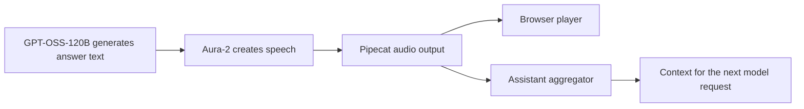

# Conversation context with Pipecat

Use Pipecat's normal voice-pipeline approach to conversation history and interruption. Put its assistant aggregator after speech synthesis and audio output, and verify the behavior with Workers AI GPT-OSS-120B and the selected speech services. Add custom behavior only when a specific requirement or failing test demonstrates a need.

The prototype still uses a custom response processor and browser reports to write history. The standard voice pipeline has not been verified in Workers.

## What the model needs to remember

Suppose the assistant says, "Tuesday morning or Thursday afternoon is available." The user answers, "The second one works."

The next model request needs the earlier answer to understand "the second one." Pipecat calls the messages sent with that request the conversation context. Its assistant aggregator collects pieces of assistant text into that context. An aggregator is simply a component that gathers pieces into a message.

In a voice application, the model can generate words faster than the audio plays. If the user interrupts halfway through an answer, saving every generated word can make the next request contain words that never progressed through speech output. The selected Pipecat speech and output components should determine which text reaches the assistant aggregator.

Pipecat components pass small messages called frames. Frames can carry text, audio, or an event such as an interruption. The assistant aggregator needs the text and lifecycle frames from the speech/output path. Connecting it directly to raw model tokens would not establish equivalent voice behavior. [Pipecat context management](https://docs.pipecat.ai/pipecat/learn/context-management), [Pipecat interruptions](https://docs.pipecat.ai/pipecat/fundamentals/interruptions)

The exact interrupted text depends on the selected TTS service, output component, timing information, and frame ordering. Output progress also does not prove that a person heard the sound. The initial scope does not promise exact-word browser playback tracking.

## Why the prototype needs a change

The current pipeline contains a user aggregator and a custom `GenerateResponse` processor. That processor calls the model, synthesizes speech, and sends audio itself. It does not install an assistant aggregator or send the usual assistant text through a standard speech/output pipeline. [Current pipeline](https://github.com/korinne/pipecat-on-workers/blob/6c17c0805f13f7609ba0a93ea8bf4c945797de18/src/conversation.py#L99)

Instead, the application writes an assistant sentence into context after the direct WebSocket browser reports finishing its audio chunks. The SFU path has no equivalent sentence reports, so the application omits its assistant answers. Its `playback_ready` event means the receiver is ready, not that a sentence finished. This omission follows an application rule; it does not establish a missing SFU feature. [Current history code](https://github.com/korinne/pipecat-on-workers/blob/6c17c0805f13f7609ba0a93ea8bf4c945797de18/src/conversation.py#L389), [browser player](../public/audio-player.mjs), [SFU receiver](../public/sfu-client.mjs)

Pipecat's assistant aggregator can write context without those custom browser receipts. Its text and interruption handlers are present in the pinned source. The [guarded core check](../scripts/check_pipecat_core.py) exercises them with synthetic text and interruption frames. That check does not include real TTS or browser output. [Pinned assistant aggregator](https://github.com/pipecat-ai/pipecat/blob/3dede06bec0b497bddfdcf047af7495ee9d0726e/src/pipecat/processors/aggregators/llm_response_universal.py#L1776)

The vendored subset also omits upstream `TTSService` and `BaseOutputTransport`. Their compatibility and dependencies need examination before choosing the supported pipeline. A successful aggregator-only check cannot establish that the full path runs unchanged in Workers. [Pinned TTS base](https://github.com/pipecat-ai/pipecat/blob/3dede06bec0b497bddfdcf047af7495ee9d0726e/src/pipecat/services/tts_service.py), [pinned output base](https://github.com/pipecat-ai/pipecat/blob/3dede06bec0b497bddfdcf047af7495ee9d0726e/src/pipecat/transports/base_output.py)

## The implementation boundary

Use the paired Pipecat user and assistant context components where supported. Integrate Workers AI STT, hosted Pipecat Smart Turn, GPT-OSS-120B, and Aura-2 through the relevant Pipecat service and turn interfaces. [Goals](GOALS.md) defines the service scope and the remaining STT choice.

The GPT-OSS service adapter must identify user-facing answer text before passing it into the speech/output path. Reasoning and protocol events must stay out of TTS, browser transcripts, and ordinary assistant dialogue. The assistant aggregator then collects the answer text that progresses through the selected output components. [AI2](ACCEPTANCE.md#ai2-stream-gpt-oss-answers-into-speech) checks this boundary, completion, and cancellation; it has not been run against GPT-OSS here.

For history and output, the implementation should:

1. Verify the normal TTS/output-to-aggregator path with the selected services and package. Record any necessary deviation and the test that justifies it.
2. Let the assistant aggregator write assistant context. Commit its update before the next model request reads context. Remove the SFU omission rule and avoid a second history writer in `played()`.
3. Preserve the direct WebSocket player's queue controls and receipt validation where needed for bounded output. Removing receipt-based history writes must not remove protection against unlimited buffering or stale callbacks.
4. Persist and restore the committed context for the agreed reconnect behavior. Bound retained history, preserve message order, and prevent duplicate answers. Define how existing saved sessions are handled; do not invent answers missing from old history.
5. Handle interruption, provider failure, and disconnect with explicit cancellation and recovery behavior. Reuse Pipecat's lifecycle events, adapter state, and existing logs where they suffice.

Production needs enough runtime state to identify the active response and reject obsolete work. It does not, by itself, require a separate permanent delivery ledger. For example, if answer 17 is canceled, late audio from answer 17 must stay canceled even after answer 18 starts.

These features are outside the initial scope unless a reviewed requirement establishes a need:

- Retaining every generated token regardless of speech/output progress.
- A new permanent response schema tracking generation, submission, and playback separately.
- Routine "playback unknown" notes inserted into model requests.
- Browser reports identifying the exact last word played, or resuming speech from that word.

A TTS failure still needs a defined outcome. The minimum safe fallback is to stop the failed response and report the failure. Any retry or continued-conversation path must have tested context behavior. A delivery-status note may become useful for a specific recovery flow, but it is not a default substitute for handling the error.

## What the tests must establish

| Situation | Required observation |
| --- | --- |
| Reasoning or other non-answer events arrive | They do not become spoken text, browser transcript text, or ordinary assistant dialogue. The service adapter handles the verified response format. |
| Completed answer | The next model request includes the assistant text committed by the selected Pipecat speech/output path. A fixture checks the exact expected text. |
| Follow-up such as "the second one" | The model receives the relevant earlier answer. A separate live conversation checks whether the model uses it correctly. |
| Interruption during speech | Context matches the chosen Pipecat components' documented and tested progress behavior. Canceled text and audio do not leak into the next turn. Do not guess a word boundary from elapsed time. |
| Model finishes before speech finishes | An interruption follows speech/output progress, without assuming all generated text was played. |
| TTS, model, or transport fails | The defined failure or recovery path completes without hanging, replaying stale output, duplicating context, or silently treating the failed operation as successful. |
| Reconnect | The agreed resume-or-new-call behavior preserves context order and isolates callbacks from the old connection. |
| Long call | Retained history, pending audio, and background work stay within the agreed limits. |

Run these scenarios through direct WebSocket and the SFU adapter. Explain any difference from the reference behavior. Browser stopping time requires a real browser measurement; an application-level clear event only establishes that the stop request was sent.

The existing local probes describe the prototype. Their generated-text checks used an earlier proposed policy. Keep those results as historical evidence and add acceptance checks for the selected Pipecat speech/output behavior. [Acceptance plan](ACCEPTANCE.md), [test instructions](DEVELOPMENT.md).
