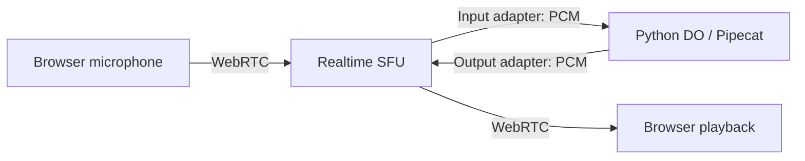

# Realtime SFU status and remaining work

Reviewed September 29, 2026 against `6c17c0805f13f7609ba0a93ea8bf4c945797de18`.
This is a source and evidence review; it does not claim a new deployed voice run.

## What already works

The basic SFU integration is implemented. The recorded September 25 run completed
two speech turns through browser WebRTC, SFU adapters, the Python Durable Object,
Pipecat, and Workers AI, with nonzero decoded response audio. The reviewed source
matches the hashes in the existing [review record](../evidence/review-checks.json).
The [activation evidence](../evidence/sfu-activation.json) identifies deployment
`acc191fa-56ef-4fc7-a4fa-8545061a079d` and explicitly excludes physical-device
acceptance and verification of server resource counts after that call.

Implemented pieces include microphone publication, authenticated signaling and
media callbacks, an input adapter, an output adapter, protobuf framing, streaming
resampling, paced output, and a separate receiving peer for each response.
See [the transport flow](../TWO-EXAMPLES.md#sfu-flow).

Cloudflare supports both audio directions using separate adapters and 48 kHz
stereo PCM. The repo implements this contract; another WebRTC server or a native
Pipecat WebRTC transport is not required for this design. See the
[Cloudflare adapter contract](https://developers.cloudflare.com/realtime/sfu/features/media-transport-adapters/websocket-adapter/).

For a new deployment, configure `DEMO_ACCESS_KEY`, `REALTIME_SFU_APP_ID`, and
`REALTIME_SFU_APP_SECRET`, and use a public WSS origin for callbacks. The existing
activation record says these were configured for that deployment; it is not a
check of today's live credentials. Follow the [setup instructions](../README.md#set-up-your-own-deployment).

## Work needed for a dependable conversation

Priority 1 items affect normal conversation or recovery. Priority 2 items close
lifecycle and acceptance gaps. These are open implementation tasks, not fixes
included in this documentation change.

### 1. Preserve assistant context without inventing playback confirmation

**Priority 1 — functionality.** SFU replies appear in the visible transcript but
never enter model or stored assistant history. This affects the next turn as
well as reconnect: “explain your second suggestion” lacks the previous answer.

Evidence: [`ConversationSession` initializes an SFU-specific history policy](../src/conversation.py#L84),
[`output_audio()` bypasses the receipt ledger](../src/conversation.py#L390), and
[`played()` ignores SFU receipts](../src/conversation.py#L420). The existing
[SFU conversation test](../tests/test_sfu_conversation.py) explicitly verifies
that even a completed reply adds no assistant history.

Recommended change: keep generated assistant text with explicit delivery state
(unconfirmed, interrupted, or confirmed where observable), and define what the
next model request and restored transcript receive. Generated context can support
follow-ups while disclosing uncertain delivery. Exact parity with WebSocket
sentence receipts requires an additional playback-accounting design.
`playback_ready`, submitted bytes, and elapsed timers do not establish playback.

**Acceptance:** refer to a previous answer before and after reconnect; interrupt
halfway through a response and verify the chosen history policy. Keep generated
text distinct from any claim that the user heard it.

### 2. Remove remote cleanup from the interruption path

**Priority 1 — responsiveness.** [`invalidate()`](../src/conversation.py#L294)
sends browser clear, then awaits [`SfuTransport.clear()`](../src/sfu_transport.py#L496).
That method waits for sequential adapter closes, session inspection, and track
closes. Each request has its own network timeout. Slow SFU cleanup therefore
delays Pipecat's processing of subsequent frames, although the browser has already
detached the old receiver. `server_clear.dispatch_ms` is recorded after that
wait and includes cleanup time.

Recommended change: advance the generation and retire local media immediately;
record clear dispatch separately; queue remote cleanup under one owned task with
a bounded retry/deadline policy. Ensure subsequent `send_audio()` calls also avoid
waiting on the old generation's cleanup. Retain ownership of late allocations.

**Acceptance:** hold or fail SFU close requests while interrupting. The browser
must stop the old receiver and the next turn must proceed while cleanup remains
owned. Verify that late responses cannot attach or submit old audio. Measure
dispatch, remote cleanup, and acoustic stop time separately.

### 3. Allow transient media recovery

**Priority 1 — reliability.** [`_read_input()`](../src/sfu_transport.py#L355)
converts a socket error/close into `recoverable: false` immediately. The
[`entry.py` event callback](../src/entry.py#L230) enqueues terminal shutdown, and
the browser ends the call. This defeats the input adapter's recovery window.
The transport can accept a replacement input socket, but the fatal path usually
tears down its owner first.

Cloudflare retries stream-mode egress callbacks for up to five seconds at the
same endpoint. Ingest adapters have no automatic reconnect. See
[adapter recovery](https://developers.cloudflare.com/realtime/sfu/features/media-transport-adapters/websocket-adapter/#automatic-reconnection-for-streaming).

Recommended change: distinguish transient transport loss from invalid media;
retain the input callback capability during a bounded recovery window and
cancel that wait on reconnection. After exhaustion, recreate the input adapter
or end visibly. For output loss, retire the response and recreate an ingest
adapter under an explicit recovery policy. Do not silently replay uncertain
audio. Clear incomplete recognition state when audio has been lost.

The browser already has bounded **control-WebSocket** reconnect that creates
fresh peers; this is separate from media recovery. A failed WebRTC peer currently
ends the call. ICE restart or peer recreation remains additional work if calls
must survive network changes.

**Acceptance:** brief input-adapter disconnect, reconnect-window exhaustion,
mid-response ingest loss, control reconnect, and a network change. Verify visible
state, bounded attempts, no stale audio, and no abandoned resources in each case.

### 4. Retain ownership until final cleanup settles

**Priority 2 — lifecycle.** Failed closes retain resource IDs inside
[`SfuTransport`](../src/sfu_transport.py#L516), but
[`Conversation.shutdown()`](../src/entry.py#L369) drops the live session and
transport references at End. It saves a diagnostics snapshot without a retry
owner. A second `close()` can retry in a unit test; the DO does not schedule one.
The browser receives `ended` before server shutdown finishes.

Recommended change: keep ownership through a bounded final retry, preserve
unresolved cleanup state if retries must survive object loss, and expose a
distinct cleanup result. Keep uncertain allocations explicit after lost creation
responses. Known remote resources and uncertain allocations need separate counts.
Empty SFU sessions expire; do not invent a session-delete API.

**Acceptance:** End, abandonment, End during negotiation, a delayed allocation,
and transient close failures. Read authenticated server diagnostics after
shutdown; require zero known adapters, tracks, sessions, pending requests, and
provider/Pipecat resources for a clean pass. Nonzero uncertain allocations mean
cleanup is unproven, even when known counts are zero. A browser “Resources
released” message is insufficient.

## Latency, audio quality, and network coverage

- **Measure first-response latency.** Every response creates an ingest adapter,
  publication, receiving session, and peer, then negotiates before sending PCM
  ([server](../src/sfu_transport.py#L409), [browser](../public/sfu-client.mjs#L112)).
  Production also waits 1,200 ms after the final provider EndOfTurn. Record these
  stages and browser decoded-audio onset. Reuse a track only after establishing
  how interruption excludes its buffered audio.
- **Validate spoken interruption and speaker echo.** Both transports request
  browser echo cancellation and use local microphone energy plus Flux turn
  events. Echo can trigger false interruption. Test headphones first, then
  speakers; qualify or revise onset detection based on measured failures.
- **Test restrictive networks.** The client configures Cloudflare STUN only
  ([configuration](../public/sfu-client.mjs#L14)). A separately provisioned TURN
  fallback and ICE-restart logic are absent. Test the intended network/device
  matrix before deciding whether additional relay configuration is necessary.
  This is not evidence that the demonstrated SFU path cannot connect.

## Acceptance still missing

Run the checks below on one identified deployment after the behavior fixes.
Preserve commit, deployment version, browser/device/network, results, and failures.

| Check | Required evidence |
| --- | --- |
| Basic SFU audio | Two-way audio and intelligible playback through `/webrtc`; record input, adapter, RTP, and decoded-audio observations. |
| Conversation continuity | A prior user fact and a previous-answer follow-up, including reconnect and interrupted replies. |
| Interruption | Natural speech during output, pending model/tool work, slow cleanup, and recovery without old-generation audio. |
| Failure recovery | Input/output adapter loss, control disconnect, peer failure, and exhausted retries. |
| Duration and isolation | A current-revision ten-minute run with two independent SFU calls. Existing long WebSocket runs do not cover this. |
| Cleanup | Authenticated post-shutdown counters for normal End, abandonment, and partial startup failures. |
| Device audio | Headphone and speaker checks, autoplay recovery, echo behavior, and measured acoustic stop time if claimed. |

The unlinked `/transport-check` page can publish a prerecorded WAV through the
same SFU client without a physical microphone. It observes RTP and decoded audio,
and supports Interrupt, Replay input, and End. It is useful for transport checks;
it does not export server cleanup proof or measure acoustic delivery. See the
[client notes](../public/CLIENT-NOTES.md#developer-transport-acceptance-page).

The `scripts/*real*.mjs` provider harnesses use direct WebSocket PCM and playback
receipts. They need an SFU-capable browser runner to cover the equivalent WebRTC
cases. Their existing passes must not be relabeled as SFU results.

Recommended order: make interruption and cleanup ownership independent of SFU
request latency, implement media recovery, add the chosen assistant-history
semantics, then run the SFU acceptance matrix and use its latency measurements
to decide whether a persistent output track is justified.
