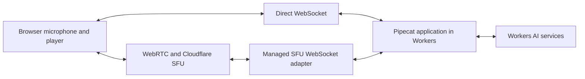

# Choose a transport for the same voice application

The initial target is one Pipecat voice application on Workers with two connection choices: direct browser WebSocket, or WebRTC through Cloudflare's SFU and managed WebSocket adapter. Choose the transport when creating a call. Switching transports during a call is outside the initial scope.

The target uses Workers AI for STT, hosted Pipecat Smart Turn, GPT-OSS-120B, and Aura-2 on both paths. Both must preserve the selected Pipecat conversation and interruption behavior. The existing examples are under evaluation; the full standard pipeline has not yet been verified in Workers.

## What changes when the transport changes

A microphone produces audio. Speech recognition turns it into words, a model generates an answer, and speech synthesis turns the answer into audio. Pipecat coordinates those steps. The transport carries audio between the browser and that application.

An SFU forwards media between endpoints. The assistant's answer comes from the voice application; "an answer delivered through the SFU" describes how its audio reaches the browser.

The direct path uses this application's audio and control messages. The managed SFU adapter converts between compressed WebRTC Opus audio and raw 48 kHz stereo PCM audio carried over WebSocket. PCM contains audio samples directly. The application still converts sample rates and channel counts for its selected speech services. [Cloudflare adapter documentation](https://developers.cloudflare.com/realtime/sfu/features/media-transport-adapters/websocket-adapter/), [current SFU implementation](../src/sfu_transport.py)

Task 2 routes both inputs through the same Nova-3/hosted Smart Turn coordinator after conversion to PCM16 mono at 16 kHz. It uses the same speech-onset, pause, transcript-coverage and revision checks on either route; the SFU transport does not choose a different completion rule. The new turn path passes controlled verification, with actual Workers execution and live audio still untested. Llama, Aura-2 and the existing assistant-history differences remain until Task 3. [Turn coordination and limits](CONVERSATION.md#task-2-user-turn-coordination)

## Reuse Pipecat's interfaces

Start with Pipecat's transport, service, and frame interfaces. Put connection setup, packet translation, and required audio conversion in the adapter for each route. Use the same GPT-OSS service adapter, speech pipeline, and assistant aggregator for conversation behavior. Model requests and streamed-answer parsing belong in that shared service connection; the transport adapters own the audio formats and delivery for each route. [Conversation context](CONVERSATION.md) explains the expected wiring and its current verification limits.

This work does not require a new public transport plugin API. A small internal interface may be needed to connect the existing routes; its shape should follow the selected Pipecat components and demonstrated integration needs.

The application and adapters still need to meet these observable requirements:

| Behavior | What to verify on each route |
| --- | --- |
| Start a call | Input and output become usable for the intended conversation, and setup failure has a defined outcome. |
| Carry audio | The format, channel count, sample rate, and ordering match the selected services. A normal call produces intelligible speech in both directions. |
| Remember the conversation | Follow-ups receive the context committed by the selected Pipecat speech/output path. Transport choice does not independently select a history policy. |
| Interrupt an answer | Cancel obsolete generation and output, stop browser audio within the agreed delay, and prevent late packets or callbacks from reviving it. |
| Proceed after an interruption | Once obsolete output is safely isolated, slow resource cleanup does not unnecessarily block the next model turn. Cleanup retains an owner and bounded lifetime. |
| Handle a slow connection | Bound queued audio and work. Define the outcome when those bounds are reached. |
| Disconnect or end a call | Release resources, make repeated close requests safe, and keep old callbacks out of a replacement connection. |

These are behavior checks, not a requirement for every audio packet to carry a new response schema. Existing Pipecat events, adapter state, and application identifiers may satisfy them.

The prototype's direct WebSocket history waits for browser chunk-completion reports. The SFU path has no equivalent reports and omits assistant answers. That is a current application limitation to replace with the selected Pipecat pipeline. Exact-word browser playback reports are not a prerequisite for the initial transport work. The tests still need to distinguish sending a stop command from the browser actually stopping its sound. [Current history code](../src/conversation.py), [browser player](../public/audio-player.mjs), [SFU receiver](../public/sfu-client.mjs)

## What earns a support claim

Direct WebSocket and SFU must pass the shared conversation, interruption, failure, reconnect, and resource tests in actual Workers with a real browser. Controlled tests should also delay callbacks, hold cleanup open, and fill queues so failures can be reproduced. The exact latency, duration, concurrency, and cost thresholds still need agreement before benchmarking.

[Acceptance plan](ACCEPTANCE.md), [implementation order](IMPLEMENTATION-PLAN.md).
